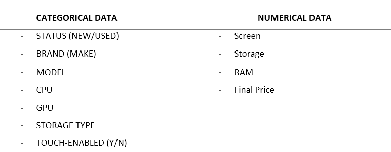
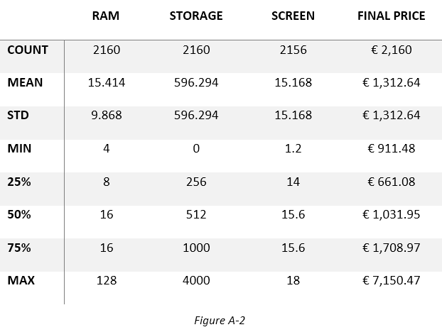
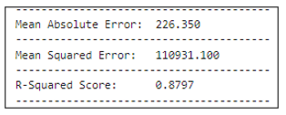
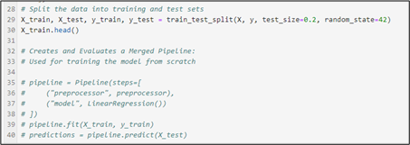
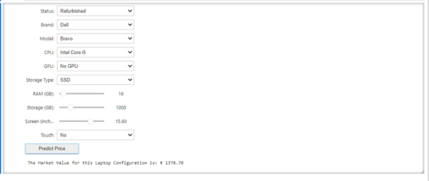

  

  
  
  
  
  

AI Laptop Price Predictor

Author: Ben Porter

Pulled from a [Kaggle Library](https://www.kaggle.com/datasets/juanmerinobermejo/laptops-price-dataset) (Merino, 2023), this csv text data originates from a Spanish website containing information on PC components. Prices are based on regional currencies, so the nominal value should not be considered to reflect currency adjustments or inflation. As the data was primarily created using Euros, this is the most appropriate figure for describing the final price. For training, we split the data for preprocessing amongst the categorical and nominal datasets.

 

From these two classifications, the model’s preprocessor can interpret categorical features based on their unique values before merging them with the nominal data. Now that we’ve described the breadth of the data, we should represent the depth. Figure A-2 below shows that this dataset represents 2,160 records, and its numerical data ranges for each feature are also listed.

Mean Absolute Error (MAE): 
This metric measures the average of the absolute differences between predicted and actual values. It provides a clear and direct interpretation of how far off our predictions were, on average.

Mean Squared Error (MSE): 
MSE gives the average of the squared differences between predicted and actual values. It penalizes larger errors more severely than smaller ones, which makes it particularly useful when we want to identify significant discrepancies in predictions.

R-Squared Score: 
This metric provides an indication of how well the input data explain the variance in the output, dependent variables. The closer the R-Squared value is to 1, the more confidence the model has in the relationship between input and output (Fernando 2023).

### Installation

For Installation of MarketMean on Windows 10/11.
1. Visit Python.org.
  - Download the latest version of Python 3 for Windows.
  - Run the installer. Be sure to add Python to PATH.
2. Install Jupyter Notebook:
  - Open Command Prompt as an administrator.
  - Enter the following command: `pip install notebook`
  - Once installation is complete, you can launch Jupyter Notebook by entering: `jupyter notebook`
  - For Git Bash the run: `python -Xfrozen_modules=off -m notebook`
3. Install Required Python Libraries
  -	wheel
  -	pandas
  -	sklearn
  -	numpy
  -	joblib
  -	ipywidgets
  -	IPython
4. Run marketmean.ipynb. This is where the first read of the “laptops.csv” file is conducted by Pandas, and the dataframe object is construct, and the raw data is processed.
5. Proceed to Section 2 “Crafting and Training MarketMean”. If your machine has the “joblib” module already installed from Anaconda, your “joblib” import call might be located in “sklearn.externals” or “sklearn.extensions”.
 	- Optionally, if you would like to train a new model, you can uncomment lines 35-40.

6. Section 3 Training Performance Results. Load the joblib file with the correct name. Your results will be printed below.
7. Section 4 Configure your own Laptop:

