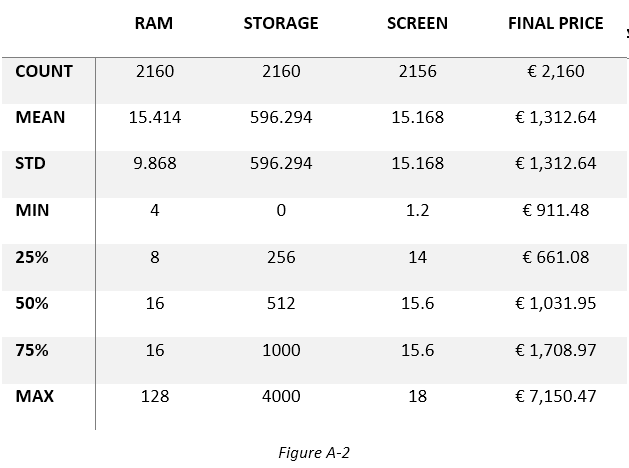

# MarketMean
#### A Laptop Price Predictor
Author: Ben Porter

Pulled from a Kaggle Library (Merino, 2023), this csv text data pulls from a Spanish website that sources information on PC components. Prices are based on regional currencies, so the nominal value should not be considered to reflect currency adjustments or inflation. As the data was primarily created using Euros, this is the most appropriate figure for describing the final price. For training, we split the data for preprocessing amongst the categorical and nominal datasets.

 

From these two classifications, the model’s preprocessor can interpret categorical features based on their unique values before merging them with the nominal data. Now that we’ve described the breadth of the data, we should represent the depth. Figure A-2 below shows that this dataset represents 2,160 records, and its numerical data ranges for each feature are also listed.

